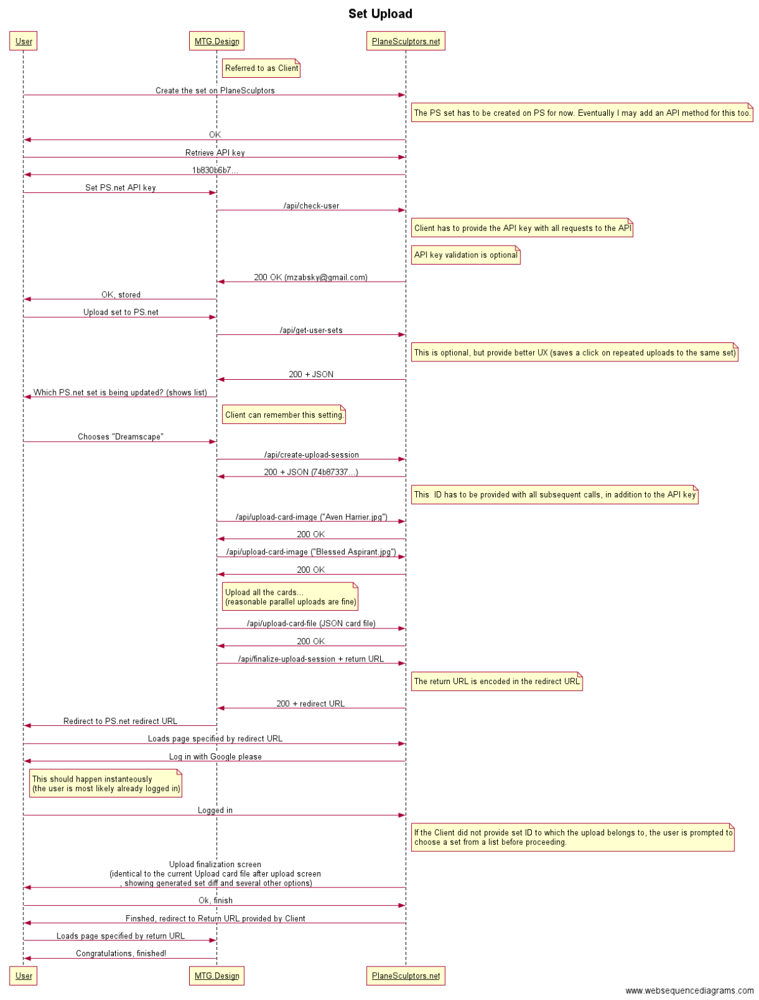

# PlaneSculptors API Documentation
Terminology:
- **Client** is the application calling the PlaneSculptors API, regardless whether it is a web application, a desktop application or another kind of caller.
- **Server** is PlaneSculptors.net.
- **User** is the person using the Client to upload their set to the Server.

## Set upload
The following diagram sums up the process of pushing a set to PS using the API:

## User API key
Many methods require the client to provide a user's API key. The user can find their API key in their member area on PlaneSculptors and can copy it to the caller's application, which is expected to store it indefinitely for all future communication with PS (the user can reset their API key, cutting off all the apps they have previously authenticated using the old API key).

The client provides the API key using an `apiCode` POST parameter. If no (or an invalid) API key is provided to a method that expects it, a 401 HTTP code is returned.

Methods that don't require API key are considered public.

## Upload session
Upload session represents the act of uploading a single complete set. An upload session is initiated by calling `/api/create-upload-session` which returns an upload session ID. This ID is then provided by the client to the subsequent methods.

One user can have only one upload session active at a time (creating an session cancels all existing ones). There is no explicit time limit imposed on duration of an upload session.

If a method which requires upload session ID is not provided one, a 400 HTTP code is returned. If the upload session ID provided is not currently active (eg. because a new session started in the meantime), a 409 HTTP code is returned.

## Methods
All methods are invoked using the POST HTTP method.

All methods return a 2xx HTTP code if successful and 4xx or 5xx code if unsuccessful. If a detailed diagnostic message is available, it is provided using the reason phrase field in the HTTP response.

All requests are expected to be encoded in UTF8. All responses will be encoded in UTF8 as well.
### /api/get-user
Returns information about the user owning the API key.
- **Requires API key:** Yes
- **Requires upload session ID:** No
- **Request:** No additional parameters.
- **Response:** 
The response body contains following JSON object:
```
{
    'id': 15,
    'name': 'Example User',
    'email': 'example@example.com',
    'urlName': 'example-user',
    'url': 'http://www.planesculptors.com/user/example-user',
    'about': 'Markdown code for the user\'s description',
    'createdOn': '2012-04-23T18:25:43.511Z'
}
```

### /api/get-user-sets
Returns sets owned by the user owning the API key.
- **Requires API key:** Yes
- **Requires upload session ID:** No
- **Request:** No additional parameters.
- **Response:** 
The response body contains following JSON object:
```
{
	'sets': <<array of set objects>>
}
````
Each set object looks like this:
```
{
    'id': 64,
    'name': 'Dreamscape',
    'urlName': 'dreamscape',
    'url': 'http://www.planesculptors.com/set/dreamscape'
}
```

### /api/create-upload-session
Creates a new upload session. Cancels any existing upload sessions.
- **Requires API key:** Yes
- **Requires upload session ID:** No
- **Request:** No additional parameters.
- **Response:** The response body contains following JSON object:
```
{
	'uploadSessionId': '74b87337454200d4d33f80c4663dc5e5'
}
```

### /api/upload-card-image
Uploads a single card image to the current upload session for the user owning the API key.
- **Requires API key:** Yes
- **Requires upload session ID:** Yes
- **Request:** A single POST file upload named `file` with any (reasonable) file name containing a JPG or PNG file, using `multipart/form-data` content disposition.
- **Response:** An empty JSON object.
- **Notes:** 
The image must be a valid JPG or PNG image. The image must be exactly 375 px wide and 523 px high. The file size must be no greater than 100 kB. No more than 1000 images are allowed (and cards).

If the method is called repeatedly with the same name in the same upload session, the image will be overwritten and only the one uploaded the last will be used.

Feel free to initiate multiple card image uploads simultaneously (within reason, of course).

### /api/upload-card-file
Uploads a card file for the set to the current upload session for the user owning the API key.
- **Requires API key:** Yes
- **Requires upload session ID:** Yes
- **Request:** A single POST file upload named `file` with any (reasonable) file name containing a text file, using `multipart/form-data` content disposition.
- **Response:** An empty JSON object.
- **Notes:** 
The file must be a text file in the format as described on the [set file format page](cardfile.md), encoded in UTF8. The file must be no larger than 100 kB.

If the method is called repeatedly in the same upload session, the file will be overwritten and only the one uploaded the last will be used.

This method may be called before or after card image uploads, the order doesn't matter.

Note that detailed validations of the individual cards are not that at the time of calling of this method, those are only done after `/api/finalize-set-upload` is called.

### /api/finalize-upload-session
Finalizes the set upload session for the user owning the API key, returning a redirect URL which is to be opened for the user to actually finish the set upload process directly on PlaneSculptors.
- **Requires API key:** Yes
- **Requires upload session ID:** Yes
- **Request:** 
`returnUrl` - specifies a URL, to which the user will be redirected to when the upload process is finished. If this argument is not provided, a standard PlaneSculptors confirmation page will be shown.
`setId` - specifies an ID of a set to which this set upload belongs to. This ID can be obtained using the `/api/get-user-sets` method. If this argument is not provided, the user will be
- **Response:**
The response body contains following JSON object:
```
{
	'redirectRequired': true, 
	'redirectUrl': 'http://www.planesculptors.net/member-area/login?return=http://www.planesculptors.net/member-area/finish-set-import?return%3Dhttp%25253a%25252f%25252fwww.planesculptors.net%25252fmember-area%25252fmanage-set%25252f2%25253fset-version-created%26setId%3D2'
}
```
The `redirectRequired` field specifies if opening the `redirectUrl` is required. If it is `false`, no further action from the client is required. If it is `true`, the client is expected to redirect to the `redirectUrl` (if the client is a web application, if it is a desktop/mobile application, it is expected to launch a browser opening this URL). This URL is only valid for several minutes, so the client needs to proceed as soon as possible.
- **Notes:**
When this URL is called, the current upload session is finalized (all the files are moved to another location). Calling this method again without re-uploading all the files with inevitably result in an error.

This method also validates the set file and that all the images for all the cards were uploaded.
